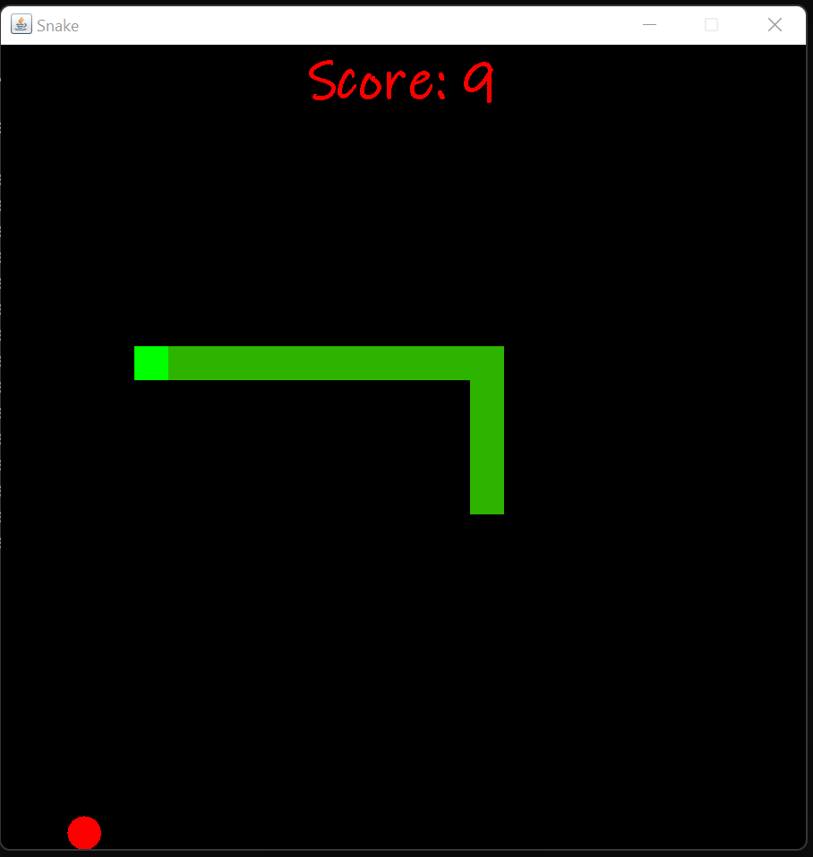
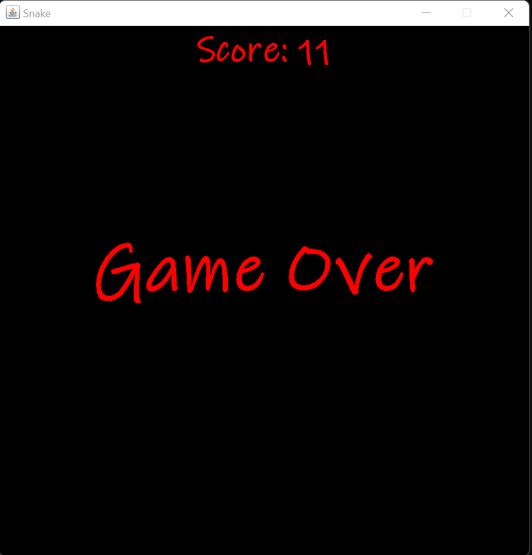

# snake_game_java
___
## Classical computer game implemented using swing and awt libraries
___
To start game follow to bin folder and run in terminal:
```java
    java SnakeGame
```
---
##### Or download executable from root of repo and run as usual Windows app, provided that you have installed JRE on your machine
---
## Game process
Use arrow keys on keyboard to control snake


## Game over
Once you hit borders of screen or your tail game is over


